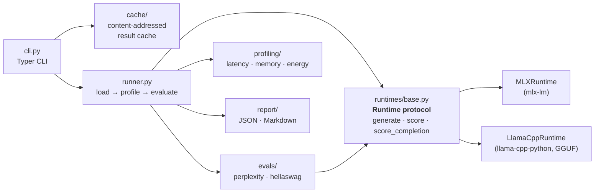

# silicon-eval

[](https://github.com/Indy102/silicon-eval/actions/workflows/ci.yml)

Evaluation and profiling harness for LLMs on Apple Silicon. Measure the
quality / performance / efficiency tradeoffs of quantized models across
runtimes, and decide what to ship on-device with numbers instead of vibes.

> **Status: v0.5.** Two runtimes — MLX and llama.cpp — behind one protocol:
> perplexity on WikiText-2, HellaSwag accuracy, latency + memory profiling,
> powermetrics energy sampling, JSON + Markdown reports, and a
> content-addressed result cache.

## Why

Picking a model for on-device inference means choosing a model **and** a
quantization level **and** a runtime — and the tradeoffs are coupled. 4-bit
halves your memory but what does it do to MMLU? Is MLX or llama.cpp faster
for *your* model on *your* chip? silicon-eval runs the matrix and gives you
one comparison table.

## Example results

Qwen2.5-0.5B-Instruct across quantization levels — one command, one table:

```sh
silicon-eval run --model mlx-community/Qwen2.5-0.5B-Instruct --quant 4bit,8bit,bf16 \
    -o report.json --markdown report.md
```

| quant | ppl (wikitext2) | hellaswag acc_norm | ttft (s) | gen tok/s | prompt tok/s | peak metal |
|-------|-----------------|--------------------|----------|-----------|--------------|------------|
| 4bit  | 21.82           | 0.490              | 0.122    | 139.8     | 334.0        | 287 MB     |
| 8bit  | 17.87           | 0.480              | 0.144    | 81.4      | 266.1        | 522 MB     |
| bf16  | 17.89           | 0.470              | 0.178    | 47.9      | 177.7        | 969 MB     |

*Measured 2026-07-15 on an Apple M1 (8 GB unified memory), macOS 26.5,
Python 3.13.0, mlx 0.32.0, mlx-lm 0.31.3. Perplexity over the first 25,600
tokens of WikiText-2 (raw, test); HellaSwag over the first 100 validation
items; latency is the mean of 3 runs of 64 tokens after 1 warmup.*

The table is the pitch: on this model, **8-bit matches bf16 quality (ppl
17.87 vs 17.89) at 70% higher throughput and half the memory**, while 4-bit
trades ~4 perplexity points for 3× bf16's speed at a third of the memory.
(At 100 items the HellaSwag differences are within sampling noise — the
perplexity column is the sensitive quality signal here.)

And across runtimes — the same base model through MLX and llama.cpp:

| runtime   | quant | ppl (wikitext2) | ttft (s) | gen tok/s | prompt tok/s |
|-----------|-------|-----------------|----------|-----------|--------------|
| mlx       | 4bit  | 21.82           | 0.122    | 139.8     | 334.0        |
| llama.cpp | 4bit  | 18.87           | 0.035    | 77.7      | 318.7        |
| mlx       | 8bit  | 17.87           | 0.144    | 81.4      | 266.1        |
| llama.cpp | 8bit  | 18.44           | 0.030    | 65.4      | 368.8        |

The 8-bit rows agreeing within half a perplexity point is the pipeline
cross-validating itself. The 4-bit rows are the interesting decision:
**llama.cpp's Q4_K_M keeps near-8-bit quality (18.87) where MLX's 4-bit
costs ~4 points (21.82) — but MLX generates ~80% faster.** Which one ships
depends on whether your workload is quality- or throughput-bound; the
quantization *schemes* differ at the same nominal width, and timing is
measured differently per runtime — see
[ADR-004](https://github.com/Indy102/silicon-eval/blob/main/docs/adr/004-cross-runtime-comparability.md).
(An earlier draft of this table showed llama.cpp TTFT of 0.014 s — a KV
prefix-cache artifact, since fixed by resetting the cache per measured run.
The kind of bug this project exists to catch.)

Raw reports:
[MLX](https://github.com/Indy102/silicon-eval/blob/main/docs/benchmarks/qwen2.5-0.5b-m1-2026-07-15.json)
(measured 2026-07-15) ·
[llama.cpp](https://github.com/Indy102/silicon-eval/blob/main/docs/benchmarks/qwen2.5-0.5b-llamacpp-m1-2026-07-16.json)
(measured 2026-07-16 UTC, llama-cpp-python 0.3.34, same machine and eval budgets).

## Install

Requires Python 3.11+ and an Apple Silicon Mac for actual inference. Until
the first PyPI release, install straight from the repository:

```sh
pip install "silicon-eval[mlx] @ git+https://github.com/Indy102/silicon-eval"
```

Add the `llamacpp` extra for cross-runtime comparisons
(`silicon-eval[mlx,llamacpp]`) — note llama-cpp-python compiles from source
on first install.

## Quickstart

```sh
silicon-eval run --model mlx-community/Qwen2.5-0.5B-Instruct --quant 4bit,8bit \
    -o report.json --markdown report.md
```

Each variant gets generation profiling (time-to-first-token, prompt and
generation tok/s over repeated runs, peak memory), perplexity on WikiText-2,
HellaSwag multiple-choice accuracy, and — where available — energy per token,
printed as a table and written as structured JSON and/or a Markdown
comparison. Results are cached per config, so re-runs only compute what
changed ([ADR-003](https://github.com/Indy102/silicon-eval/blob/main/docs/adr/003-result-cache.md)). Useful knobs:

- `--ppl-windows N` — how many 512-token windows of WikiText-2 to score
  (default 50 ≈ 25k tokens; `0` = full corpus). Scored token counts are
  recorded in the report, and all variants score the identical prefix. See
  [docs/adr/002](https://github.com/Indy102/silicon-eval/blob/main/docs/adr/002-perplexity-methodology.md)
  for the methodology.
- `--hs-items N` — HellaSwag validation items (default 100; small-sample
  noise is real, but variants are compared on identical items).
- `--mmlu` — add MMLU (zero-shot answer-letter scoring, `--mmlu-items`,
  off by default). Note tiny models score near chance (0.25) on MMLU —
  it differentiates meaningfully from ~1B parameters up.
- `--runs / --warmup` — measured and unmeasured generation repetitions.
- `--no-perplexity / --no-hellaswag / --no-energy` — skip pieces.
- `--no-cache` — re-measure everything and refresh the cached entries.

Energy sampling uses `powermetrics`, which needs root. Grant passwordless
sudo for both the sampler and the signal used to stop it (via `sudo visudo`):

```
<user> ALL=(root) NOPASSWD: /usr/bin/powermetrics, /bin/kill
```

(`/bin/kill` is required too — powermetrics runs as root, so silicon-eval
stops it through `sudo -n kill`.) Alternatively run silicon-eval itself with
sudo. Without either, the run degrades gracefully and reports why. Note a
cached variant remembers that energy was unavailable — after enabling sudo,
re-measure with `--no-cache`.

Model ids follow mlx-community naming: pass the base id and silicon-eval
appends `-4bit` / `-8bit` / `-fp16` / `-bf16` per quantization level, or pass
the exact repo id for a single level. (fp16 and bf16 are distinct formats —
check which one mlx-community actually published for your model.)

For llama.cpp, pass a GGUF repository instead and pick the runtime:

```sh
silicon-eval run --runtime llama.cpp --model Qwen/Qwen2.5-0.5B-Instruct-GGUF \
    --quant 4bit,8bit -o llamacpp.json
```

silicon-eval matches the repo's `.gguf` files against the level (`4bit` →
`Q4_K_M`, then `Q4_0`; `8bit` → `Q8_0`; …). Cross-runtime rows compare what
each runtime ships at a level — the quantization *schemes* differ; see
[ADR-004](https://github.com/Indy102/silicon-eval/blob/main/docs/adr/004-cross-runtime-comparability.md).

What the numbers mean:

- **ppl** — perplexity over a fixed WikiText-2 prefix; comparable across the
  variants in one report, not to published sliding-window results.
- **hswag** — HellaSwag accuracy (length-normalized log-likelihood scoring,
  lm-eval-style) over the first `--hs-items` validation items.
- **ttft / gen t/s** — steady-state stats over `--runs` generations, after
  `--warmup` unmeasured runs absorb kernel-compilation cost.
- **peak metal** — accelerator-side peak unified memory since the variant's
  model load (weights + KV cache + activations). This is the "will it fit"
  number for MLX rows; llama.cpp exposes no equivalent, so its rows show n/a
  and RSS is the closest available footprint there.
- **peak rss** — host-side process RSS, and its meaning flips per runtime:
  for MLX, Metal-backed model memory largely does **not** appear here (treat
  it as Python/tokenizer overhead); for llama.cpp, RSS **includes** the
  mapped model weights and the scoring logits buffer, so it approximates the
  real footprint.
- **mJ/tok** — system-wide CPU+GPU+ANE energy per generated token over
  dedicated generation runs; includes machine baseline load, so keep the
  machine otherwise idle.

As a library:

```python
from silicon_eval.evals import PerplexityConfig, PerplexityEvaluator
from silicon_eval.runner import build_report, run_variant
from silicon_eval.runtimes import get_runtime
from silicon_eval.runtimes.base import ModelSpec, Quantization

variant = run_variant(
    get_runtime("mlx"),
    ModelSpec("mlx-community/Qwen2.5-0.5B-Instruct", Quantization.Q4),
    prompt="Explain KV caching in one sentence.",
    evaluators=[PerplexityEvaluator(PerplexityConfig(max_windows=50))],
)
print(variant.generation.generation_tps.mean, "tok/s")
```

## Architecture



```
silicon_eval/
  runtimes/        # Runtime protocol + MLXRuntime + LlamaCppRuntime
  evals/           # perplexity on WikiText-2, HellaSwag multiple-choice
  profiling/       # generation latency stats, RSS sampling, powermetrics energy
  report/          # JSON schema + machine info + Markdown renderer
  cache/           # content-addressed result cache
  runner.py        # per-variant orchestration: load → profile → evaluate
  cli.py           # Typer CLI
```

The load-bearing decision: evals and profiling depend on a `Runtime`
*protocol*, never on MLX directly, so new backends drop in without touching
measurement code. See
[docs/adr/001-runtime-abstraction.md](https://github.com/Indy102/silicon-eval/blob/main/docs/adr/001-runtime-abstraction.md).

## Contribute your chip's numbers

The tables above are one machine (M1, 8 GB). Reports from other Apple
Silicon chips — M2/M3/M4, Pro/Max/Ultra — are the most useful contribution
this project can receive. Run:

```sh
silicon-eval run --model mlx-community/Qwen2.5-0.5B-Instruct --quant 4bit,8bit,bf16 \
    -o report.json --markdown report.md
```

and open a PR adding both files under `docs/benchmarks/` named
`qwen2.5-0.5b-<chip>-<date>.{json,md}`. The JSON carries the machine and
version stamps that make results comparable.

## Development

```sh
python -m venv .venv && source .venv/bin/activate
pip install -e ".[dev,mlx]"

ruff check . && ruff format --check .   # lint
mypy                                     # typecheck (strict)
pytest                                   # unit tests (no MLX needed)
pytest -m slow --no-cov                  # integration test: real 0.5B model, Apple Silicon only
```

CI (GitHub Actions) runs lint, typecheck, and unit tests on Linux — the
runtime layer is mocked there. Integration tests require Apple Silicon and
run locally only.

Troubleshooting: if `silicon-eval` fails with `ModuleNotFoundError: No module
named 'silicon_eval'` after an editable install on macOS, check whether the
OS stamped the install's `.pth` file with the hidden flag — Python 3.13+
silently skips hidden `.pth` files, and some sandboxed/agentic environments
re-apply the flag after you clear it:

```sh
ls -lO .venv/lib/python3.13/site-packages/*.pth   # look for "hidden"
chflags nohidden .venv/lib/python3.13/site-packages/*.pth
```

If the flag keeps coming back, either run with the project root on
`PYTHONPATH` (`PYTHONPATH="$PWD" silicon-eval …`) or use a regular install
(`pip install .`), which doesn't rely on a `.pth` file.
